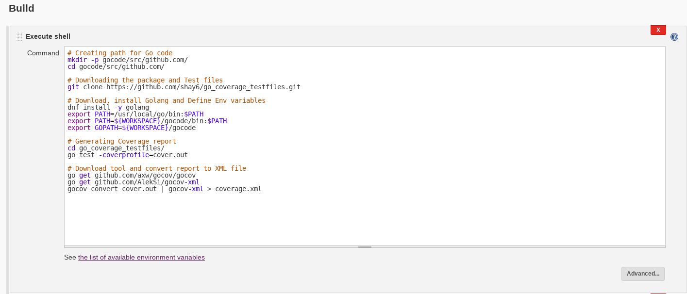

# Golang Code Coverage

The following document goes through running code coverage for Golang,
 automation with Jenkins and integration with SonarQube. As you can read in
 [The Go Blog](https://blog.golang.org/cover) - The code coverage tool to be
 used for Golang is a built-in tool.

This document is separated into 3 parts:

- **Manual Coverage** - section will present you the supported method of
     running code coverage on Golang.
- **Jenkins Automation** - section will introduce the basic steps in order to
     automate the coverage process using the web UI.
- **SonarQube Integration** - section will teach you how to publish your
     results to SonarQube using the Jenkins web UI as well as manually.

 ------------------------------------------------------------------------------

## Manual Coverage

### Prerequisites

- Golang 1.10+

> ⚔ Note: The release of Go 1.2 introduces the new built-in tool for
     test coverage. It is strongly recommend reading
     [The Go Blog](https://blog.golang.org/cover) in order to understand
     how it works.

### Running code coverage manually

1. running code coverage `go test -cover`

2. You can ask "go test" to run coverage as before but also write
    a "coverage profile" for us, a file that holds the collected statistics
    so we can study them in more detail. To do that use the -coverprofile flag
    to specify a file for the output like that:
    `go test -coverprofile=cover.out`

3. To study the "cover.out" file, we can run the test coverage tool ourselves,
    without "go test" and we can brake it down by function with
    `go tool cover -func=cover.out`

4. A much more interesting way to see the data is to get an HTML presentation
    of the source code decorated with coverage information. This display is
    invoked by the -html flag: `go tool cover -html=cover.out`.
    When this command is run, a browser window pops up, showing the covered
    (green), uncovered (red), and uninstrumented (grey) source.

#### Example

The following example includes small function and test file and a correction of
 the tests according to the results we received from coverage results. Let's
 assume you have the following 2 Golang files:

- **size.go**

```
package size

func Size(a int) string {
    switch {
    case a < 0:
        return "negative"
    case a == 0:
        return "zero"
    case a < 10:
        return "small"
    case a < 100:
        return "big"
    case a < 1000:
        return "huge"
    }
    return "enormous"
}
```

- **size_test.go**

```
package size

import "testing"

type Test struct {
    in  int
    out string
}

var tests = []Test{
    {-1, "negative"},
    {5, "small"},
}

func TestSize(t *testing.T) {
    for i, test := range tests {
        size := Size(test.in)
        if size != test.out {
            t.Errorf("#%d: Size(%d)=%s; want %s", i, test.in, size, test.out)
        }
    }
}

```


> ⚔ Note: You need to create a file whose name ends _test.go that contains the
     TestSize function as described here. Put the file in the same package as
     the one being tested. The file will be excluded from regular package
     builds but will be included when the “go test” command is run. For more
     detail about testing you can see [here](https://golang.org/pkg/testing/)

1. run the command `go test -cover`

```
PASS
coverage: 42.9% of statements
ok      size    0.026s
%
```

Notice that the coverage is 42.9%, which isn't very good. Before we ask how to
 raise that number, let's see how that was computed. When test coverage is
 enabled, "go test" runs the "cover" tool, a separate program included with
 the distribution, to rewrite the source code before compilation. Here's what
 the rewritten Size function looks like.


  ```
    func Size(a int) string {
        GoCover.Count[0] = 1
        switch {
        case a < 0:
            GoCover.Count[2] = 1
            return "negative"
        case a == 0:
            GoCover.Count[3] = 1
            return "zero"
        case a < 10:
            GoCover.Count[4] = 1
            return "small"
        case a < 100:
            GoCover.Count[5] = 1
            return "big"
        case a < 1000:
            GoCover.Count[6] = 1
            return "huge"
        }
        GoCover.Count[1] = 1
        return "enormous"
    }

  ```

Each executable section of the program is annotated with an assignment
 statement that, when executed, records that that section ran. When the test
 run completes, the counters are collected and the percentage is computed by
 seeing how many were set.

A big advantage of this source-level approach to test coverage is that it's
 easy to instrument the code in different ways. For instance, we can ask not
 only whether a statement has been executed, but how many times.

The go test command accepts a -covermode flag to set the coverage mode to one
 of three settings:

  - set: did each statement run?
  - count: how many times did each statement run?
  - atomic: like count, but counts precisely in parallel programs

we can simply use it by running the following command

```
go test -covermode=count -coverprofile=count.out

```
2. Now in order to raise the coverage number we can add some test cases
    in our var "tests" in size_test.go file like that:

```
var tests = []Test{
    {-1, "negative"},
    {5, "small"},
    {0, "zero"},
    {99, "big"},
    {999, "huge"},
}
```

3. Then run again "go test -cover" and the output should look like:

```
PASS
coverage: 85.7% of statements
ok      size    0.001s
%
```

This has been a better result than the previous one!


--------------------------------------------------------------------------------

## Jenkins Automation

### Prerequisites

- [Jenkins v1.653+](https://jenkins.io/)
- [Cobertura plugin
    v1.9.8+](https://wiki.jenkins-ci.org/display/JENKINS/Cobertura+Plugin)
- testing environment running:

  - fedora v28
  - Golang 1.10.3
  - git

  > ⚔ Note: you could either use a provisioning system such as [docker daemon](https://docs.docker.com/engine/reference/commandline/dockerd/),
[OpenShift](https://github.com/openshift), [OpenStack](https://github.com/openstack), [Kubernetes](https://kubernetes.io/), etc. or use a local environment.

> ⚔ Note: notice there are several methods and tools to manage CI and
     automation such as [Gump](https://gump.apache.org/),
     [Hudson](http://hudson-ci.org/),
     [Bamboo](https://www.atlassian.com/software/bamboo),
     [Travis](https://travis-ci.org/) and more.
     We will only introduce and support Jenkins for this end as it is the
     standardized CI tool in RedHat.

### Automating using the web UI and Uploading coverage results to Jenkins

Continuing from the previous chapter, assuming our project files are held on
 a remote github repository **[https://github.com/shay6/go_coverage_testfiles](https://github.com/shay6/go_coverage_testfiles)**.

#### Example

1. In the main Jenkins page, click on `New Item` button to create a new job


2. Name your job, select the `Freestyle Project` radio button and save the
    new job


3. On the newly opened screen, scroll down and create a new bash script
    build step


4. Sometimes it's useful to have your coverage results uploaded to your
    Jenkins job which could ease troubleshooting procceses in case of large
    scale development efforts which might require several independent coverage
    jobs.

For that purpose, we will use the [Jenkins Cobertura plugin](https://wiki.jenkins-ci.org/display/JENKINS/Cobertura+Plugin)
 in order to preview this results in our job's web UI.

 Paste the following deployment script onto the bash text editor.

```shell
# Install dependencies
yum install -y wget

# Creating path for Go code
mkdir -p gocode/src/github.com/
cd gocode/src/github.com/

# Downloading the package and Test files
git clone https://github.com/shay6/go_coverage_testfiles.git

# Download, install Golang and Define Env variables
wget https://dl.google.com/go/go1.10.3.linux-amd64.tar.gz
tar -C /usr/local -xzf go1.10.3.linux-amd64.tar.gz
rm go1.10.3.linux-amd64.tar.gz
export PATH=/usr/local/go/bin:$PATH
export PATH=${WORKSPACE}/gocode/bin:$PATH
export GOPATH=${WORKSPACE}/gocode

# Generating Coverage report
cd go_coverage_testfiles/
go test -coverprofile=cover.out

# Download tool and convert report to XML file
go get github.com/axw/gocov/gocov
go get github.com/AlekSi/gocov-xml
gocov convert cover.out | gocov-xml > coverage.xml
```

> ⚔ Note: We are installing Golang using wget instead of yum because we
         want to install Go 1.10 release and it's not uploaded to RHEL
         subscription manager repository.

> ⚔ Note: the **-y** parameter in the yum command approves installation
         prompts which is mandatory for automation purposes.

> ⚔ Note: the **${WORKSPACE}** environment variable is used by Jenkins in
         order to point to the current build's working directory.



Let's have a look for a moment at our script, we can see it's divided into
 some parts:

- Installation of prerequisites
- Preparing path for the code, install Golang, and defining env variables
- Cloning the project from GitHub and running our tests with coverage to
   create a report (as seen in the previous chapter)
- Converting the coverage output file (cover.out) using
   [gocov-xml](https://github.com/AlekSi/gocov-xml) to an XML one in order
   to publish it on Jenkins using Cobertura.

> ⚔ Note: in most cases, each of these parts will be more complicated
       and it's a good habit to break each part into it's own bash build
       step to ease troubleshooting.

> ⚔ Note: with cover.out file we can publish the report to SonarQube
       and with coverage.xml file we can publish it in Jenkins
       using Cobertura.


5. In the job's configuration screen, add a "post-build action". upload the
    "coverage.xml" file which we created with gocov-xml.


6. Input a relative glob path to the generated report path and save the job
    in order to push the "coverage.xml" file which we created with gocov-xml.

```
**/gocode/src/github.com/go_coverage_testfiles/coverage.xml
```


7. Run a build of our newly created job.


8. After running our job you will be able to view the report's preview in
    your job's main screen.


**And we're done!** on the next chapter you will learn how to publish your
   generated results into SonarQube to view them.


--------------------------------------------------------------------------------

## SonarQube Integration

### Prerequisites

- [Jenkins v1.653+](https://jenkins.io/)
- [SonarQube v6.7 LTS](https://docs.sonarqube.org/display/SONAR/Setup+and+Upgrade)
- [SonarQube Runner v2.8+](https://docs.sonarqube.org/display/SCAN/Analyzing+with+SonarQube+Scanner)

> ⚔ Note: in order to deploy a SonarQube instance, you can refer to the
     [Installing Sonar Server v5.6.3](https://docs.engineering.redhat.com/display/CentralCI/Installing+Sonar+Server+v5.6.3)
     document or use the Central-CI instances,
     see [Central CI SonarQube Instances](https://docs.engineering.redhat.com/display/CentralCI/Central+CI+SonarQube+Instances) for more information.

> ⚔ Note: for Jenkins Sonar plugin configuration see
     [Analyzing with SonarQube Scanner for Jenkins](https://docs.sonarqube.org/display/SCAN/Analyzing+with+SonarQube+Scanner+for+Jenkins) for details.

### Integrating SonarQube through the Jenkins web UI

As a direct continuation of the previous chapter, building on the same Jenkins
 job, we'll now add the SonarQube integration.

#### Example

1. In the job configuration, choose "Add build step"
    and "Execute SonarQube Scanner"


2. Paste your sonar parameters onto the text editor and SAVE the job


 Now let's have a look at these parameters:

```shell
# projectKey (string): SonarQube project identification key (unique)
sonar.projectKey=go-coverage
# projectName (string): SonarQube project name (NOT unique)
sonar.projectName=go-coverage
# projectVersion (decimal): Analyzed project version (unique)
sonar.projectVersion=1.0
# sources (string): source code home directory
sonar.sources=.
# projectBaseDir (string): project home directory (same as sources)
sonar.projectBaseDir=${WORKSPACE}/gocode/src/github.com/go_coverage_testfiles/
# language (string): project language(go)
sonar.language=go
# inclusions (string): file inclusion pattern
sonar.inclusions=**/*.go
# exclusions (string): file exclusion pattern
sonar.exclusions=**/*_test.go
# coverage files
sonar.go.coverage.reportPaths=cover.out
# sonar user token
sonar.login=<your token>
```

> ⚔ Note: With cover.out file we can publish the report to SonarQube and
     with coverage.xml file we can publish it in Jenkins using Cobertura.

> ⚔ Note: For generating your token see the instruction
     [in SonarQube official site](https://docs.sonarqube.org/display/SONAR/User+Token)

> ⚔ Note: for further details on SonarQube analysis parameters,
     see [Analysis Parameters](https://docs.sonarqube.org/display/SONAR/Analysis+Parameters).

3. Run a build again to view the reported results


 You'd now be able to see a link to the results on the job's page which will
  lead you to the SonarQube dashboard.

  

**And we are done!** you will now have a link to the published
   SonarQube report dashboard

  

### Publishing to SonarQube manually

Sometimes it's useful to be able to publish our coverage report to
 SonarQube manually. Although it is **not a recommended** methodology,
 we will elaborate upon the needed steps for those ends.

> ⚔ Note: in this section we assume you are running an up-to-date RedHat
     distribution(Fedora, CentOS, RHEL)

#### Example

As a continuation of the previous examples and assuming our generated
 coverage report is located in our project folder.

1. Follow the instruction of SonarQube documentation and install
    [v3.2+ of SonarScanner](https://docs.sonarqube.org/display/SCAN/Analyzing+with+SonarQube+Scanner),
    which is the client agent for the SonarQube server. In addition add the
    <install_directory>/bin directory to your PATH.

2. Now, in addition to our previous scanning parameters while publishing to
    sonar through the Jenkins UI:

    ```shell
    # projectKey (string): SonarQube project identification key (unique)
    sonar.projectKey=go_coverage_testfiles
    # projectName (string): SonarQube project name (NOT unique)
    sonar.projectName=go_coverage_testfiles
    # projectVersion (decimal): Analyzed project version (unique)
    sonar.projectVersion=1.0
    # sources (string): source code home directory
    sonar.sources=.
    # projectBaseDir (string): project home directory (same as sources)
    sonar.projectBaseDir=<path to your project folder>
    # language (string): project language(py)
    sonar.language=go
    # inclusions (string): file inclusion pattern
    sonar.inclusions=**/*.go
    # exclusions (string): file exclusion pattern
    sonar.exclusions=**/*_test.go
    # sonar user token
    sonar.login=<your token>

    ```

    We will now also include the SonarServer URL, in this example we are
     using the CentralCI production instance:

    ```shell
    # host.url (string): the URL pointing to the SonarServer instance
    sonar.host.url=http://sonar-server.lab.eng.rdu2.redhat.com:9000
    ```

    Create a configuration file in the root directory of the project called
     "sonar-project.properties" and copy all parameters to this file.

    Run the following command from the project base directory to
     launch the analysis:

    ```shell
    sonar-scanner
    ```

3. Finally, you should be able to see a success prompt with a link to your
    published coverage report dashboard such as this one:

    ```shell
    INFO: Analysis report uploaded in 522ms
    INFO: ANALYSIS SUCCESSFUL, you can browse http://sonar-server.lab.eng.rdu2.redhat.com:9000/dashboard/index/go_coverage_testfiles
    INFO: Note that you will be able to access the updated dashboard once the server has processed the submitted analysis report
    INFO: More about the report processing at http://sonar-server.lab.eng.rdu2.redhat.com:9000/api/ce/task?id=AWWp5vn7Nh3poVd2aRoR
    INFO: Task total time: 5.748 s
    INFO: ------------------------------------------------------------------------
    INFO: EXECUTION SUCCESS
    INFO: ------------------------------------------------------------------------
    INFO: Total time: 7.688s
    INFO: Final Memory: 8M/246M
    INFO: ------------------------------------------------------------------------

    ```

    **And your results have been published! (:**

------------------------------------------------------------------------------
